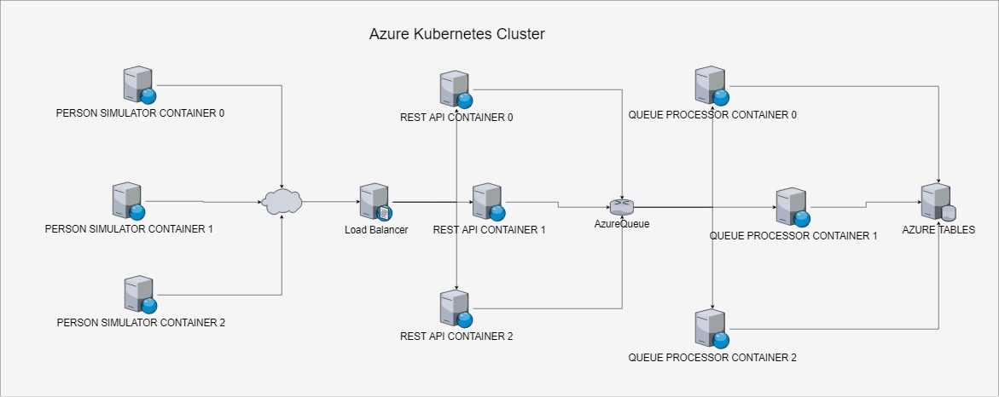
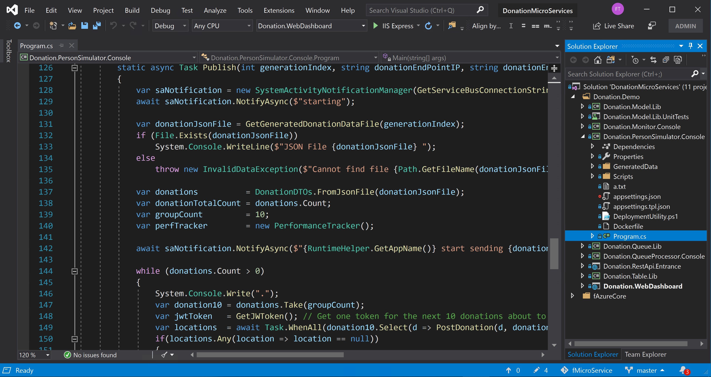
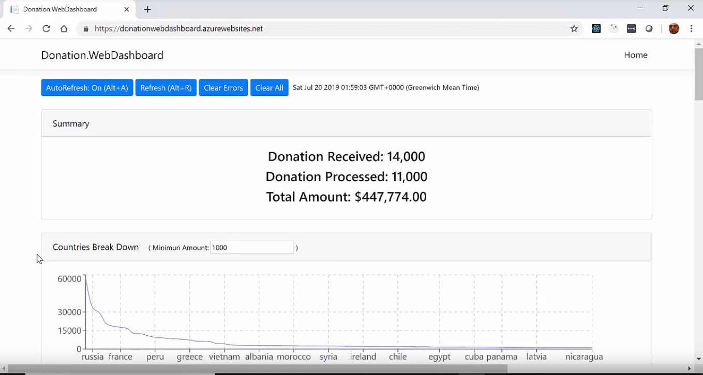
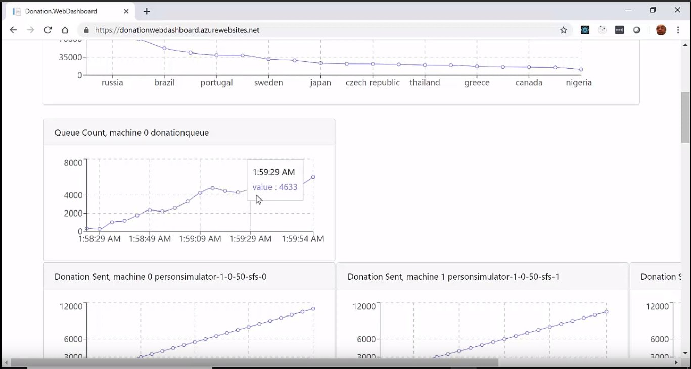
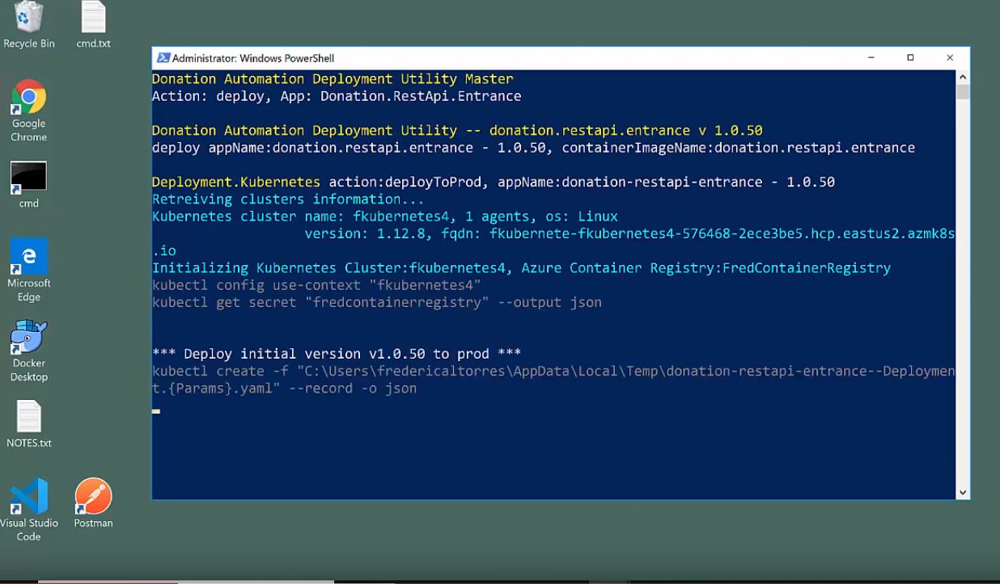
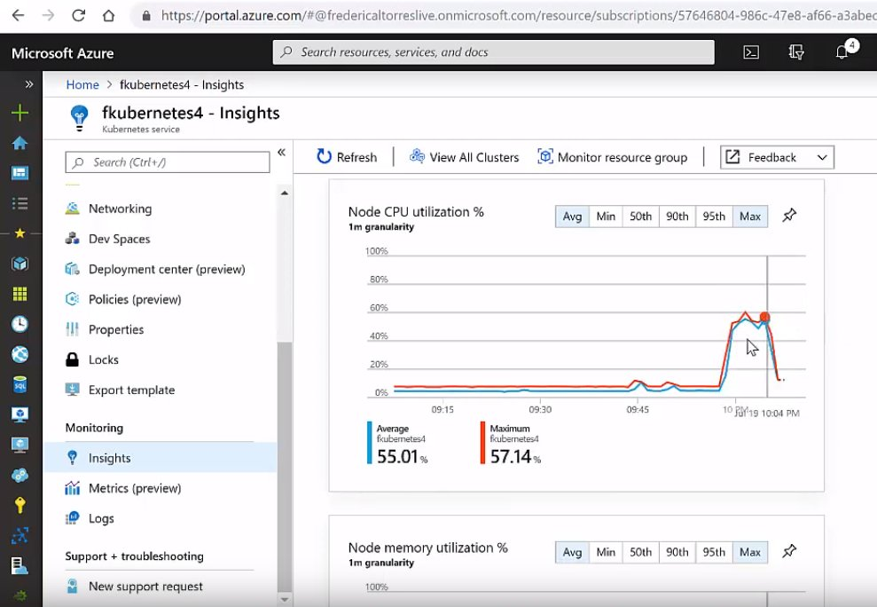

# fMicroService
## Overview
In this github repository, I am experimenting building microservices with 
- .NET Core
- Docker
- Kubernetes on Azure

My goal is to build a case study that I can use to evaluate the scalability possibilities of the technologies mentioned above.

- Other Azure resources used: table, queue, service bus, web site, load balancer.

## Index
- [Case Study: An fictional online donation back end](#Case-Study-An-fictional-online-donation-back-end)
- [Build and Deployment](#Build-and-Deployment)

## Case Study: An fictional online donation back end

- I am going to build a back end able to received and processed online donations with a monitoring
web dashboard.
- The donations should be created by hundreds of thousands users entering donation amounts and credit card information on a web site and press send.

Here is the overview execution architecture:


### The Person Simulator
I will not build the front end, but to simulate the donations sent I will create a .NET Core console application that can be instantiated up to 10 times in Docker containers in an Azure Kubernetes cluster.



Each instance will read a specific local JSON file 
[donation[X].json](https://raw.githubusercontent.com/fredericaltorres/fMicroService/master/DonationMicroServices/Source/Donation.PersonSimulator.Console/GeneratedData/donation.SmallSample.json)
containing 50 000 donations instances like this one
```JSON
{
 "Guid":"cd7af44d-db7b-4d4c-9157-052ce5f50836",
 "FirstName":"Sonny","LastName":"Haking","Gender":"Male",
 "Email":"shaking0@theguardian.com", "Phone":"310-632-6062","IpAddress":"138.27.230.192",
 "Country":"Indonesia","Amount":"$91.37",
 "CC_Number":"4026367644878790","CC_ExpMonth":12,"CC_ExpYear":2022,"CC_SecCode":233
}
```
and execute an HTTP POST to a specific end point for each donation.
The console has the ability to execute 10 HTTP POSTs in parallel.
For every 500 donations sent, the application send to an Azure Service Bus channel (Publisher/Subscribers) 
a message containing performance information.

* [Source Code](https://github.com/fredericaltorres/fMicroService/tree/master/DonationMicroServices/Source/Donation.QueueProcessor.Console)



### The Rest Api
A .NET Core REST API will implement the HTTP POST to received the donations.
Multiple instances of the API process will be deployed and executed as a Docker container
behind a load balancer provisioned using Azure Kubernetes cluster.
When a donation is received, it is
- Validated
- Pushed to an Azure Queue
- For every 500 donations received, the endpoint send to an Azure Service Bus channel (Publisher/Subscribers) a message containing performance information.

* [Source Code](https://github.com/fredericaltorres/fMicroService/tree/master/DonationMicroServices/Source/Donation.RestApi.Entrance)

### The Queue Processor
A .NET Core console application that can be instantiated multiple times as Docker containers instances in an Azure Kubernetes cluster will
- Pop messages from the Azure Queue
- Validate the data
- Store the data in an Azure Table
- Aggregate the amounts received per country for the last 500 donations and store the result into another Azure Table.
- For every 500 donations processed, the application send to an Azure Service Bus channel (Publisher/Subscribers) a message containing the aggregated country/amount information and other performance information.

* [Source Code](https://github.com/fredericaltorres/fMicroService/tree/master/DonationMicroServices/Source/Donation.QueueProcessor.Console)

### The Web Dashboard
An ASP.NET Core Web Application implementing
- An internal endpoint named SystemActivitiesController will
    * Receive the information sent by the the different processes via the Azure Service Bus channel
    * Store and aggregate the data in static dictionaries in memory
    * Communicate the information to the Dashboard browser side via HTTP Get

    * [SystemActivitiesController source code](https://github.com/fredericaltorres/fMicroService/blob/master/DonationMicroServices/Source/Donation.WebDashboard/Controllers/SystemActivitiesController.cs)



- A Web Dashboard Single Page Application (SPA) written with React that display the performance information sent by the different processes and the donation amounts per country in charts and tables in `pseudo real time`.

    * [Web Dashboard React Component Code](https://github.com/fredericaltorres/fMicroService/blob/master/DonationMicroServices/Source/Donation.WebDashboard/ClientApp/src/components/Home.js)

* [Source Code](https://github.com/fredericaltorres/fMicroService/tree/master/DonationMicroServices/Source/Donation.WebDashboard)



- The Web Dashboard is deployed in Azure in an AppService

## Build and Deployment
The build and deployment processes consists of
1. Compiling the .NET Core projects
1. Creating the docker images locally
1. Pushing the docker images to an Azure Container Registry
1. Deploying the different container images to multiple container instances in an Azure Kubernetes cluster

All these steps are automated using PowerShell scripts and the Kubernetes command line tool [KubeCtl.exe](https://kubernetes.io/docs/reference/kubectl/overview/), running on an Azure VM.



* See powershell scripts in folder [source](https://github.com/fredericaltorres/fMicroService/tree/master/DonationMicroServices/Source)

- The file [Create.Kubernetes.ps1](https://github.com/fredericaltorres/fMicroService/blob/master/DonationMicroServices/Source/Create.Kubernetes.ps1) is used to create or delete the Azure Kubernete cluster.

- The file [DeploymentUtilityMaster.ps1](https://github.com/fredericaltorres/fMicroService/blob/master/DonationMicroServices/Source/DeploymentUtilityMaster.ps1) allow to build and deploy any or all the .NET core projects.
    * Each of the .NET Core project implement a local file named [DeploymentUtility.ps1](https://github.com/fredericaltorres/fMicroService/blob/master/DonationMicroServices/Source/Donation.PersonSimulator.Console/DeploymentUtility.ps1) which get called by the DeploymentUtilityMaster.ps1 

- The file [Deployment.Kubernetes.ps1](https://github.com/fredericaltorres/fMicroService/blob/master/DonationMicroServices/Source/Deployment.Kubernetes.ps1) is used to deploy any of the .NET Core project as a container based on the last build and last container images created and pushed into Azure.

- The file [KubernetesManager.psm1] is a re-usable library to execute Kubernetes YAML file and wait for the deployment.

- The file [Util.psm1](https://github.com/fredericaltorres/fMicroService/blob/master/DonationMicroServices/Source/Util.psm1) contains general helper functions.


### Kubernetes YAML files
A simple template engine written in PowerShell will execute the YAML template file located in folder

- See function processFile in file [Util.psm1](https://github.com/fredericaltorres/fMicroService/blob/master/DonationMicroServices/Source/Util.psm1) contains general helper functions.

* [Kubernetes.Templates](https://github.com/fredericaltorres/fMicroService/tree/master/DonationMicroServices/Source/Kubernetes.Templates)

## Videos
I recorded and narrated, a full demo of my case study.
- [01 Azure Kubernetes Cluster Creation](https://www.youtube.com/watch?v=h2w3R7iksYE)
- [02 Building the .NET Core and Docker images](https://www.youtube.com/watch?v=x-v3jAEIwVg)
- [03 Kubernetes cluster is ready](https://www.youtube.com/watch?v=r4wLyHizPhM)
- [05 Web dashboard deployment and review](https://www.youtube.com/watch?v=MyArPitInyQ)
- [04 Let's review the build result and the Azure Container Registry](https://www.youtube.com/watch?v=vtdO6aU8HKs)
- [06 Let's deploy the endpoint](https://www.youtube.com/watch?v=cPKklS3JYww)
- [07 Let's deploy the queue processor](https://www.youtube.com/watch?v=i6e9qWumf34)
- [08 Let's run the simulation (part I)](https://www.youtube.com/watch?v=-yumIshxrm0)
- [08 Let's run the simulation (part II)](https://www.youtube.com/watch?v=zWrzRKeSKOk)
- [09 Let's run the simulation (part III)](https://www.youtube.com/watch?v=6YNrc5Dic94)

## Performance Study

### Configuration For Scenario 1
The Kubernetes cluster is running 3 Linux Azure virtual machines of type
- Standard_D2_v2 - 2 cpu - 7 Gb Ram

- .NET Core App / Container
    * The app Donation.PersonSimulator.Console is instantiated 3 times as a Docker container instance
    * The app Donation.RestApi.Entrance is instantiated 3 times as a Docker container instance behind 1 Azure load balancer provisioned using Kubernetes Service.
    * The app Donation.QueueProcessor.Console is instantiated 3 times as a Docker container instance

#### Performance
For a total of 60% of CPU for the all cluster and very little memory, the web dashboard reported the following
(See video 08 and 09)
* The 3 instances of the Donation.PersonSimulator.Console are sending around 370 donations per second
* The 3 instances of the Donation.RestApi.Entrance + Load Balancer are receiving and enqueuing around 370 donations per second
* The 3 instances of the Donation.QueueProcessor.Console are processing around 280 donations per second



| Kubernetes Cluster Configuration                	| Person Simulator                	| Rest Api                       	| Queue Processor                	|
|-------------------------------------------------	|--------------------------------	|--------------------------------	|--------------------------------	|
| 3 VM of type Standard_D2_v2 (2 CPU, 7 Gb Ram)   	| 3 containers. 370 donations/S  	| 3 containers. 370 donations/S  	| 3 containers. 280 donations/S  	|
| 3 VM of type Standard_D2_v2 (2 CPU, 7 Gb Ram)   	| 4 containers. 406 donations/S  	| 4 containers. 406 donations/S  	| 4 containers. 294 donations/S  	|
| 3 VM of type Standard_D2_v2 (2 CPU, 7 Gb Ram)   	| 5 containers. 405 donations/S  	| 5 containers. 405 donations/S  	| 5 containers. 317 donations/S  	|
| 4 VM of type Standard_D2_v2 (2 CPU, 7 Gb Ram)   	| 4 containers. 474 donations/S  	| 4 containers. 406 donations/S  	| 4 containers. 328 donations/S  	|
| 5 VM of type Standard_D2_v2 (2 CPU, 7 Gb Ram)   	| 5 containers. 523 donations/S  	| 5 containers. 523 donations/S  	| 5 containers. 427 donations/S  	|
| 5 VM of type Standard_D2_v2 (2 CPU, 7 Gb Ram)   	| 6 containers. 535 donations/S  	| 6 containers. 535 donations/S  	| 6 containers. 473 donations/S  	|
| 6 VM of type Standard_D2_v2 (2 CPU, 7 Gb Ram)   	| 6 containers. 563 donations/S  	| 6 containers. 563 donations/S  	| 6 containers. 499 donations/S  	|
| 6 VM of type Standard_D2_v2 (2 CPU, 7 Gb Ram)   	| 5 containers. 506 donations/S  	| 5 containers. 506 donations/S  	| 5 containers. 417 donations/S  	|
| 3 VM of type Standard_D4s_v3 (4 CPU, 17 Gb Ram) 	| 10 containers. XXX donations/S 	| 10 containers. XXX donations/S 	| 10 containers. XXX donations/S 	|
