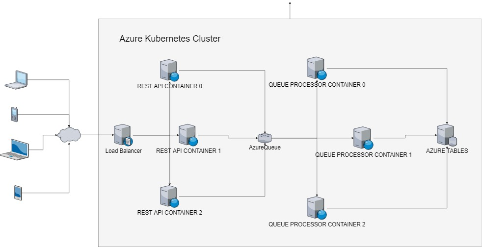

# fMicroService
In this repo I am experimenting building microservices with 
- .NET Core
- Docker
- Kubernetes on Azure

My goal is to build a case study that I can use to evaluate the scalability possibilities of the technologies mentioned above.

- Azure resources used: table, queue, service bus, web site, load balancer.

## Case Study: An fictional online donation back end

- I am going to build a back end able to received and processed online donations with a monitoring
web dashboard.
- The donations should be created by hundreds of users entering donation amounts and credit card information on a web site and press send.

### The Person Simulator
I will not build the front end, but rather create a .NET Core console application
that can be instantiated up to 10 times in Docker containers in an Azure Kubernetes cluster.

Each instance will read a specific local 
[donation[X].json](https://raw.githubusercontent.com/fredericaltorres/fMicroService/master/DonationMicroServices/Source/Donation.PersonSimulator.Console/GeneratedData/donation.SmallSample.json)
file containing 50 000 donations and execute an HTTP POST to a specific end point for each donation.
10 HTTP POSTs are executed in parallel. 
For every 500 donations sent, the application send to an Azure Service Bus channel (Publisher/Subscribers) some performance information.

* [Source Code](https://github.com/fredericaltorres/fMicroService/tree/master/DonationMicroServices/Source/Donation.QueueProcessor.Console)

### The Rest Api
A .NET Core REST API will implement the HTTP POST to received the donations.
Multiple instances of the API process will be executed in a Docker containers
behind a load balancer provisioned using Azure Kubernetes cluster. <<< TODO: Update
When a donation is received, it is 
- Validated
- Pushed to an Azure Queue
- For every 500 donations received, the endpoint send to an Azure Service Bus channel (Publisher/Subscribers) some performance information.

* [Source Code](https://github.com/fredericaltorres/fMicroService/tree/master/DonationMicroServices/Source/Donation.RestApi.Entrance)

### The Queue Processor
A .NET Core console application that can be instantiated multiple times as Docker containers instances in an Azure Kubernetes cluster will
- Pop messages from the Azure Queue
- Validate the data
- Store the data in an Azure Table
- Compute an aggregate of the amount received per country, store the data into another Azure Table.
- For every 500 donations processed, the application send to an Azure Service Bus channel (Publisher/Subscribers) the aggregated information and other performance information.

* [Source Code](https://github.com/fredericaltorres/fMicroService/tree/master/DonationMicroServices/Source/Donation.QueueProcessor.Console)

### The Web Dashboard
A ASP.NET Core Web Application implementing
- An internal endpoint named SystemActivitiesController will
    * Receive the information sent by the the different processes to the Azure Service Bus channel
    * Store and aggregate the data in static dictionaries
    * Communicate the information the Dashboard browser side 

    * [SystemActivitiesController source code](https://github.com/fredericaltorres/fMicroService/blob/master/DonationMicroServices/Source/Donation.WebDashboard/Controllers/SystemActivitiesController.cs)

- A Web Dashboard written as a Single Page Application (SPA) in React that display the performance informations sent by the different processes and the donation amount per country in charts and tables in `pseudo real time`.

    * [Web Dashboard React Component Code](https://github.com/fredericaltorres/fMicroService/blob/master/DonationMicroServices/Source/Donation.WebDashboard/ClientApp/src/components/Home.js)

* [Source Code](https://github.com/fredericaltorres/fMicroService/tree/master/DonationMicroServices/Source/Donation.WebDashboard)

- The Web Dashboard is deployed in Azure in an AppService

## Build and Deployment
The build and deployment processes consisting of
- Compiling the .NET Core projects
- Creating the docker images locally
- Pushing the docker images to an Azure Container Registry
- Deploying the different container images to an Azure Kubernetes cluster

are automated using PowerShell script and the Kubernetes command line tool KubeCtl.exe,
running on an Azure VM.

* [See powershell scripts in folder](https://github.com/fredericaltorres/fMicroService/tree/master/DonationMicroServices/Source)

### Kubernetes YAML files
A simple template engine written in PowerShell will execute the YAML template file located in folder

* [Kubernetes.Templates](https://github.com/fredericaltorres/fMicroService/tree/master/DonationMicroServices/Source/Kubernetes.Templates)

## Videos
I recorded and narrated, a full demo of my case study.
- [01 Azure Kubernetes Cluster Creation](https://www.youtube.com/watch?v=h2w3R7iksYE)
- [02 Building the .NET Core and Docker images](https://www.youtube.com/watch?v=x-v3jAEIwVg)
- [03 Kubernetes cluster is ready](https://www.youtube.com/watch?v=r4wLyHizPhM)
- [05 Web dashboard deployment and review](https://www.youtube.com/watch?v=MyArPitInyQ)
- [04 Let's review the build result and the Azure Container Registry](https://www.youtube.com/watch?v=vtdO6aU8HKs)
- [06 Let's deploy the endpoint](https://www.youtube.com/watch?v=cPKklS3JYww)
- [07 Let's deploy the queue processor](https://www.youtube.com/watch?v=i6e9qWumf34)
- [08 Let's run the simulation (part I)](https://www.youtube.com/watch?v=-yumIshxrm0)
- [08 Let's run the simulation (part II)](https://www.youtube.com/watch?v=zWrzRKeSKOk)
- [09 Let's run the simulation (part III)](https://www.youtube.com/watch?v=6YNrc5Dic94)

## Performance Study

### Configuration For Scenario 1
The Kubernetes cluster is running 3 Linux Azure virtual machines of type
- Standard_D2_v2 - 2 cpu - 7 Gb Ram

- .NET Core App / Container
    * The app Donation.PersonSimulator.Console is instantiated 3 times as a Docker container instance
    * The app Donation.RestApi.Entrance is instantiated 3 times as a Docker container instance behind 1 Azure load balancer provisioned using Kubernetes Service.
    * The app Donation.QueueProcessor.Console is instantiated 3 times as a Docker container instance

#### Performance
For a total of 60% of CPU for the all cluster and very little memory, the web dashboard reported the following
(See video 08 and 09)
* The 3 instances of the Donation.PersonSimulator.Console are sending around 370 donations per second
* The 3 instances of the Donation.RestApi.Entrance + Load Balancer are receiving and enqueuing around 370 donations per second
* The 3 instances of the Donation.QueueProcessor.Console are processing around 280 donations per second

| Kubernetes Cluster Configuration                	| Person Simulator                	| Rest Api                       	| Queue Processor                	|
|-------------------------------------------------	|--------------------------------	|--------------------------------	|--------------------------------	|
| 3 VM of type Standard_D2_v2 (2 CPU, 7 Gb Ram)   	| 3 containers. 370 donations/S  	| 3 containers. 370 donations/S  	| 3 containers. 280 donations/S  	|
| 3 VM of type Standard_D2_v2 (2 CPU, 7 Gb Ram)   	| 4 containers. 406 donations/S  	| 4 containers. 406 donations/S  	| 4 containers. 294 donations/S  	|
| 3 VM of type Standard_D2_v2 (2 CPU, 7 Gb Ram)   	| 5 containers. 405 donations/S  	| 5 containers. 405 donations/S  	| 5 containers. 317 donations/S  	|
| 4 VM of type Standard_D2_v2 (2 CPU, 7 Gb Ram)   	| 4 containers. 474 donations/S  	| 4 containers. 406 donations/S  	| 4 containers. 328 donations/S  	|
| 3 VM of type Standard_D4s_v3 (4 CPU, 17 Gb Ram) 	| 10 containers. XXX donations/S 	| 10 containers. XXX donations/S 	| 10 containers. XXX donations/S 	|
